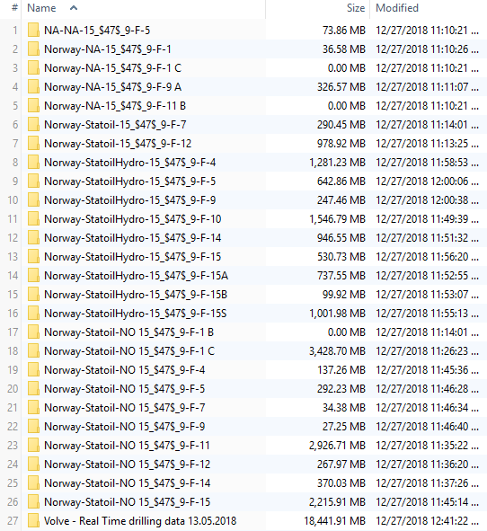
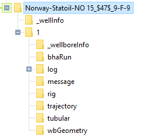
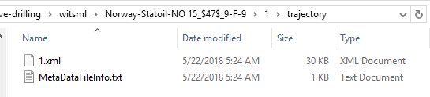
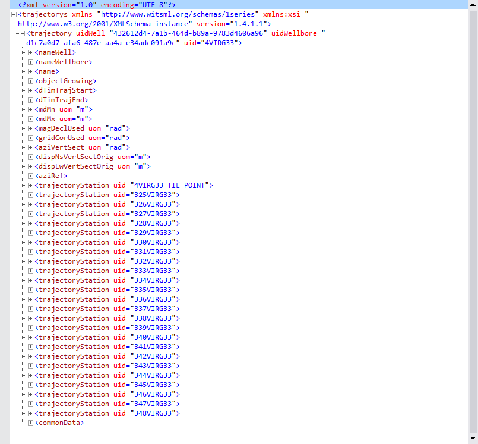
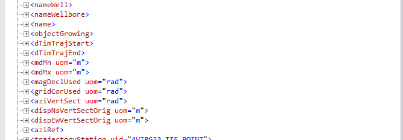
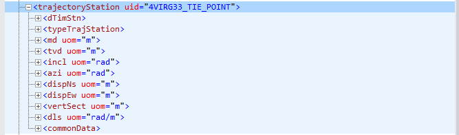
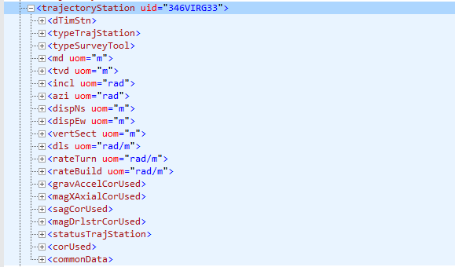

```{r setup, include = FALSE, error=TRUE, message=FALSE, warning=FALSE}
knitr::opts_chunk$set(echo = TRUE, 
                      comment = "#>",
                      collapse = TRUE,
                      error = TRUE,
                      warning = FALSE,
                      message = FALSE,
                      fig.align = 'center'
                      )
```


# Introduction
This time we will exploring drilling data that is stored using the industry standard [WITSML][witsml]. This format is widely used in the industry in drilling, completion and intervention operations, specifically for real-time surveillance. WITSML stands for *Wellsite Information Transfer Standard Markup Language*. It has a series of rules to save the data as a consistent schema but essentially is XML. Software developers and IT professionals in the oil industry know it very well. They mostly use in-house developed scripts, SDK[^SDK] in Java, [.Net][^dotnet], [C#][^csharp], or applications provided by vendors. This standard is essential to send and receive data between the rig and the offices or servers.

Since we are not writing for software developers or IT techs but for **petroleum engineers**, we need to know at least the basics of WITSML. Don't need to be experts on the subject but at least get familiar with the shape of the data, manipulation, perform some data exploration, and ultimately, be prepared, or know, what they are talking about when it is time to build an artificial intelligence agent based on a machine learning algorithm.

> On Artificial Intelligence. Again, let's touch Earth here. There is no robot, or Skynet Terminator, or an intelligent, cognitive entity in AI. Artificial Intelligence, or AI, is about making agents or applications to perform a repetitive or boring tasks that otherwise would be peformed by a human being. It is simple math, statistics and computer science.

# Motivation
I have always been intrigued by `WITSML`. Not being a drilling engineer kepts me some distance away from the daily touch with this type of data. When I had the chance, I have explored the WITSML data with a XML viewer and one thing is clear: this is not your regular nice, rectangular data, or table, that we work every day. WITSML uses a [hierarchical][hierarchical_data] data structure, pretty similar to a tree: branches and leaves. This makes it very unusual to those who are familiar with just row and columns tables. What we will try to do in this lecture is getting a basic understanding of a different [data structure][data_structure]. As a matter of fact, I find *hierarchical data structures* very applicable to production and reservoir engineering because they give us a lot of freedom in creating multiple levels for our data.

# WITSML and the Volve Drilling Dataset
We were very fortunate of getting the [Volve dataset][volve_dataset] published 7 months ago by [Equinor](https://www.equinor.com/en.html). It covers a wide array of data from different disciplines (production, reservoir, geophysics, drilling, completion, logging, etc.), with data coming in different formats. It is a very good exercise of data science for exploring the data and making discoveries.

Here is a view of all the wells that are storing data in WITSML format:

```{r, out.width = "450px", echo=FALSE}
# folders under drilling in Volve

```

Look at the size of each folder. They are considerable large if we compare to the usual files we manage every day. I am choosing the folder in row 22 (well 9f9), one of the smaller data containers (27.3 MB). If the data operations we perform here are all correct, then , generalized, they should apply well to any of the larger WITSML datasets.

A typical well with data stored in WITSML would look like this:

```{r, out.width = "300px", echo=FALSE}
# folders under the well Norway-Statoil-NO

```

From all these folders, let's focus today in the **well trajectory** dataset. 

I downloaded all the drilling data for Volve which is about 26.8 GB. Not that big if we compare to the seismic files of 1.2 and 2.4 terabytes. I chose the `trajectory` folder for well `Norway-Statoil-NO 15_$47$_9-F-9` because it seems complex enough to studying it. Besides, it wasn't too big: around 27 MB. After learning from it, we could apply our data conversion algorithms to simpler datasets.

# The `trajectory` folder and files
The `trajectory` folder is very simple. It contains WITSML files and a metadata information file (not important at this time). The folder could contain more than one file. We will see in another lecture wells with more than one trajectory file. In our example, the WITSML file has the name of `1.xml`. We will be reading it in few seconds.

```{r, out.width = "500px", echo=FALSE}
# show the two files under the well

```

# Parts of the `trajectory` dataset
Let's take a look first at the `trajectory` WITSML file. We are starting with a  collapsed tree so it doesn't take too much space of the screen. The `(+)` sign on the left means that it will expand further at that node. 

```{r, out.width = "850px", echo=FALSE}
# all the nodes, collapse

```

## The two major nodes
Starting by the top, in the second line, see the first node. `trajectorys`. This is the __root__ node. If you see one `(-)` sign on its left, it means it has been expanded. Following on the right, in red, you see labels such as `xmlns`, `xlmns:xsi`, and `version`. These are __attributes__ of `trajectorys`. They are not __nodes__ but __attributes__.

Under the root node `trajectorys` you see that it has only one child called `trajectory`. If you see that is has a `(-)` sign, then it has been expanded showing all its dependent nodes. 

So, there are then two major nodes: `trajectorys` and `trajectory`. Everything else exists under `trajectory`.

## Secondary nodes
There is a group of nodes that coexists at the same level of the most important node which is `trajectoryStation`. This group of nodes is what we call `siblings` of `trajectoryStation`. These nodes are:


    nameWell
    nameWellBore
    name
    objectGrowing
    dTimTrajStart
    dTimTrajEnd
    mdMn
    mdMx
    gridCorUsed
    aziVertSect
    dispNsVertSectOrig
    dispEwVertSectOrig
    aziRef
    ...
    ...
    ...
    commonData

The three dots correspond to `trajectoryStation` items.

```{r, out.width = "500px", echo=FALSE}
# nodes below trajectory, siblings of trajectoryStation

```

Some of these nodes will have children, others will just contain values as is the case of the nodes that go from `nameWell` up to `aziRef`. 

Some of these nodes are standalone and other have dependent nodes or children. We will see later how we find that out without having to expand each of the nodes.

The node `commonData`, for instance, is one that has children. That node will require special treatment to retrieve its data.

## The measurement nodes
The nodes `trajectoryStation` are the most important nodes in the whole dataset. They actually using very well this hierarchical data structure to keep track of the trajectory of the well. Each of the nodes for `trajectoryStation` carries a unique measurement and a unique identifier called `uid`.

The node `trajectoryStation` has also child nodes as we show below for the first child member.

```{r tS-incomplete, out.width = "600px", echo=FALSE, fig.cap="trajectoryStation with incomplete variables"}
# subnodes under the first trajectoryStation. smaller number of variables

```

Note that on the right of `trajectoryStation` there is a keyword named `uid`. As we saw before on the root node, the label on the right is called an __attribute__ of the node. In this particular case, that `uid` is the unique identifier or `uid` of that measurement point. Keep in mind that all of them are unique.

Another interesting finding is that not all `trajectoryStation` nodes have the same number of variables. Compare the figure above (Fig. \@ref(fig:tS-incomplete)) with this coming from a similarly named node in Fig. \@ref(fig:tS-complete):

```{r tS-complete, out.width = "500px", echo=FALSE, fig.cap="trajectoryStation node with all its variables"}
# complete set of subnodes for trajectoryStation

```

This hierarchical structure, as we can see, is very flexible. If there are not values, or measurements, they will not take space during storage. In tables or dataframes, they would usually be present but filled with **NA**s.

# Reading a WITSML file
Now it's time to get our hands dirty and do a bit of data science.

## Loading the packages
We will use two packages: `xml2`, `data.table` and `dplyr`. `xml2` will take care of reading the WITSML or XML files, while `dplyr` and `data.table` will be our workhorses for dataframe generation and data manipulation. The other packages will be used at the end of the article for nesting structure and plotting. I could have just used `dplyr` but I wanted to show you both table libraries.

```{r load-libraries}
# load libraries
library(xml2)
library(data.table)
library(dplyr)
library(tibble)
library(tidyr)
library(purrr)
library(ggplot2)
```

## List and load the XML files

* Using a relatively small folder of 27 MB.
* well `Norway-Statoil-NO 15_$47$_9-F-9`
* we show only show few of the files with their complete full name

```{r list-all-xml-files}
all_files_xml <- list.files("./witsml", recursive = TRUE, full.names = TRUE, 
                        include.dirs = TRUE, pattern = "*.xml")

# indices in R start at 1, not zero as in Python
all_files_xml[1:5]
```

### Select the trajectory file

```{r get-trajectory-files}
# get the file for trajectory
traj_files <- grep(pattern = "trajectory", ignore.case = TRUE, 
                   value = TRUE, x = all_files_xml)
traj_files
```

### Load the selected WITSML file

```{r read-xml-file}
dat <- read_xml(traj_files[3])
dat_9f9 <- dat
```

Retrieve some information:
```{r xml-introspection}
# some introspection
xml_name(dat)
xml_children(dat)

# name of the child node
xml_name(xml_children(dat))
xml_name(xml_child(dat))
```

## Some introspection of the XML object

### First 25 nodes
```{r first-25-nodes}
# strip default namespaces from the document
xml_ns_strip( dat )
all_nodes <- dat %>% 
    xml_find_all( '//*') %>% 
    xml_path()
    
all_nodes[1:25]                   # show only the first elements
```

### Total number of nodes
```{r toal-number-of-nodes}
# get the number of elements
dat <- xml_ns_strip( dat )
noe <- dat %>% 
    xml_find_all( '//*') %>% 
    xml_path() %>% 
    length()
noe
```

### Last 25 nodes
```{r last-25-nodes}
# let's see the last 25
tail(all_nodes, 25)
```

# Getting data from nodes and subnodes
As we described succintly above there are four main groups of nodes that we are interested in:

1. The root node
2. The `trajectory` node
3. The measurements node `trajectoryStation` and subnodes
4. The siblings of the measurements nodes

Our task is putting together all the variables and their corresponding values in a data structure that we are familiar with: a table. This step may not totally necessary if we have the proper software or tools that do the collection and search in the background for us. For the time being, let's take like it were a __data anatomy__ lesson.


## The root node, `trajectorys` 
This is the parent of the `trajectory` node. It carries not so meaningful information that I can see.

```{r}
# attributes for the root node
trajectorys <- xml_find_first( dat, "//trajectorys")
xml_attrs(trajectorys)
xml_name(trajectorys)
xml_siblings(trajectorys)    # no siblings because it is the root
```


## The `trajectory` node

### `trajectory` summary
The `trajectory` node has two sub-levels of nodes: the measurement nodes (`trajectoryStation`) and the siblings that carry metadata for the `trajectoryStation` nodes.

```{r}
# attributes of the trajectory node
trajectory <- xml_find_first( dat, "//trajectory")
xml_attrs(trajectory)

# names of the parent node
xml_name(xml_parent(trajectory))

# name of the current node
xml_name(trajectory)
```

```{r}
# name of the child nodes
xml_name(xml_children(trajectory))
```

### `trajectory` children. Method 1

```{r}
# trajectoryStation children nodes
xml_name(xml_children(xml_find_all(dat, "//trajectorys/trajectory" )))
```

At this point we don't know which node has children or dependents.

### Total number of nodes under `trajectory`
```{r}
# number of trajectoryStation children nodes
length(xml_name(xml_children(xml_find_all(dat, "//trajectorys/trajectory" ))))
```
### `trajectory` children. Method 2
```{r}
# another way of obtaining the names of the nodes for "trajectory"
xml_name(xml_children(xml_find_first(dat, "//trajectory")))
```

### `trajectory` childless nodes (with spec)
If we know by specification that a node does not have dependent nodes then we could manually indicate the indices in the vector containing their names. This requires having at hand the specification or a manual inspection node by node.

```{r}
# name of the orphan nodes
orphan_vars <- c(1:14)        # indices are being set manually.
                              # not a very practical solution

# the first 14 children of trajectory
vars14_names <- xml_name(xml_children(xml_find_first(dat,
                                                     "//trajectory")))[orphan_vars]
vars14_names
```

> Later we will find a better way of getting the nodes with no dependents by building a function of our own.

### `trajectory` children. Method 3
```{r}
# get all the nodes 
xml_children(dat) %>%     # trajectory
    xml_children() %>%    # variables and values of the children
    xml_name()            # names of the variables only
```

### Building the function `get_variables_under_node()`

```{r function-get_variables_under_node}
#' Get the names of variables under a node
#'
#' @param xml_dat a XML document
#' @param node a node of the form parent_node\child_node
#'
#' @return a character vector with the names of the variables
#' @export
#'
#' @examples
get_variables_under_node <- function(xml_dat, node) {
    xpath <- paste("//", node)
    xml_find_all(xml_dat, xpath) %>% 
    xml_children() %>% 
    xml_name() %>% 
    unique()
}
```

### Getting all variables under a specific node
```{r}
# test the function get_variables_under_node()
get_variables_under_node(dat, "trajectory")
```

```{r}
get_variables_under_node(dat, "trajectory/trajectoryStation")
```

### Build the functions `how_many_children`, `have_children`
This is the function we were looking for. A way to check if the nodes under `trajectory`, or any node, have children.

```{r function-how-many-children}
#' How many children does a parent node have
#' 
#' Returns a character vector with the name of the vector and the node count
#' @param xml_dat a XML document
#' @param node a node of the form parent_node\child_node
#'
how_many_children <- function(xml_dat, node) {
  vars_vector <- vector("integer")
  var_names <- get_variables_under_node(xml_dat, node)
  i <- 1
  for (var in var_names) {
    xpath <- paste("//", node, "/", var)  
    num_children <- max(xml_length(xml_find_all(xml_dat, xpath)))
    vars_vector[i] <- num_children
    names(vars_vector)[i] <- var
    # cat(i, var, vars_vector[i], "\n")
    i <- i + 1
  } 
  vars_vector
}
```

Testing the function `how_many_children`.

```{r test-function-how_many_children}
# test the function how_many_children()
how_many_children(dat, "trajectory")
```

> Note that only two variables have children or dependents.

### Build the functions `have_children` and `have_no_children`

```{r function-have_children}
#' Get a vector of those nodes that have children and their count
#'
#' @param xml_dat 
#' @param node 
#'
have_children <- function(xml_dat, node) {
  how_many <- how_many_children(xml_dat, node)
  how_many[how_many > 0]
}

#' Get a vector of those nodes that do not have children and their zero count.
#'
#' @param xml_dat 
#' @param node 
#'
have_no_children <- function(xml_dat, node) {
  how_many <- how_many_children(xml_dat, node)
  how_many[how_many == 0]
}
```

### test for nodes and dependents
Now we can easily find what nodes are childless

```{r find-children-trajectory-childless}
have_no_children(dat, "trajectory")
```

List only the names of the variables that have no children.

```{r}
names(have_no_children(dat, "trajectory"))
```

## Nodes under `//trajectory/trajectoryStation`

### Get trajectoryStation children. Method 1
```{r get-trajectoryStation-children-1}
# names of the children for "trajectoryStation"
xml_name(xml_children(xml_find_first( dat, "//trajectory/trajectoryStation")))
```

### Get trajectoryStation children. Method 2
This yields the same result:
```{r get-trajectoryStation-children-2}
# names of the nodes for "trajectoryStation"
xml_name(xml_children(xml_find_first(dat, "//trajectoryStation")))
```

### Get attributes of trajectoryStation
```{r get-attributes-trajectoryStation}
# find attributes of the first element of trajectoryStation found
trajectoryStation <- xml_find_first(dat, "//trajectoryStation")
xml_attrs(x = trajectoryStation)
```

### number of measurement stations

```{r number-measurement-stations}
# find all observations for dTimStn
trajectoryStation.dTimStn <- xml_find_all(dat, "//trajectoryStation/dTimStn")

# we end up finding a way to calculate the number of trajectory stations
length(trajectoryStation.dTimStn)
```

### Why the variables under trajectoryStation are different
Pay attention to these two cases when we interrogate about the name of the variables under `trajectoryStation`.

This is asking for variables in the first node:

```{r}
# name of the dependent nodes of "trajectoryStation"
xml_name(xml_children(xml_find_first(dat, "//trajectoryStation")))
```

This is asking for variables for all the nodes and taking only the unique names, those that do not repeat:

```{r}
# name of the dependent nodes of "trajectoryStation"
unique(xml_name(xml_children(xml_find_all(dat, "//trajectoryStation"))))
```

> __Note__. They are different because in the first case we are asking for the first node (`xml_find_first`) while in the second case we are asking for all the nodes (`xml_find_all`). This is normal. The reason of existence of hierarchical structures that doesn't waste space in variables that are not currently used.

### Attributes of `trajectoryStation`

```{r}
# get the attributes for trajectoryStation
xml_attrs(x = trajectoryStation)

# we get only the "uid" attribute
```

```{r}
# get the value of the attribute we found
xml_attr(x = trajectoryStation, attr = "uid")
```

## commonData: names and values
There are two type of nodes with the same name but hang from different parents:
* `//trajectory/commonData`
* `//trajectoryStation/commonData`

Both have different purposes.

### `//trajectory/commonData`
Nodes under `//trajectory/commonData`:
```{r}
# get the subnodes for //trajectory/commonData
unique(xml_name(xml_children(xml_find_all(dat, "//trajectory/commonData"))))
```

Number of nodes under `//trajectory/commonData`:
```{r}
# number of subnodes
max(xml_length(xml_find_all(dat, "//trajectory/commonData")))
```

Values for the nodes under `//trajectory/commonData`:
```{r}
# values for the first macthing node
xml_text((xml_find_first(dat, "//trajectory/commonData" ) ) )
```

### `//trajectoryStation/commonData`
Nodes under `//trajectoryStation/commonData`:
```{r}
# get the subnodes for //trajectoryStation/commonData
unique(xml_name(xml_children(xml_find_all(dat, "//trajectoryStation/commonData" ) ) ))
```

Number of nodes under `//trajectoryStation/commonData`:
```{r}
# number of subnodes for //trajectoryStation/commonData
# we use max() for the case it returns a vector with multiple nodes and lengths
max(xml_length(xml_find_all(dat, "//trajectoryStation/commonData")))
```
Values for the nodes under `//trajectoryStation/commonData`:
```{r}
# values for the first matching node
xml_text((xml_find_first(dat, "//trajectoryStation/commonData" ) ) )
```

# Creating the dataframes
At this point we have figured out how to extract the names and values from nodes in a hirerarchical structure. Now, it is time to build the tables with that data.

## `trajectory` dataframe

```{r trajectory_attr_df}
# get all attributes for trajectory node
# we try with datatable and dataframe
trajectory <- xml_find_first( dat, "//trajectory")
trajectory <- xml_attrs(trajectory)

trajectory_attr_dt <- data.table(t(trajectory))

trajectory_attr_df <- data.frame(t(trajectory), stringsAsFactors = FALSE)
trajectory_attr_df
```

```{r}
# This is the same way of getting a dataframe for trajectory
# get values for all the attributes of the trajectory node
# using magrittr
xml_find_first( dat, "//trajectory") %>% 
    xml_attrs() %>% 
    t() %>% 
    data.frame(stringsAsFactors = FALSE)
```

## Siblings of `trajectoryStation`
This takes only one row.
```{r}
# get all the trajectory variables, with and without descendants
trajectory_children <- xml_name(xml_children(xml_find_first(dat, "//trajectory")))

# get only those variables without descendants. hnc: have no children
traj_hnc_names <- names(have_no_children(dat, "trajectory"))
traj_hnc_idx <- which(trajectory_children %in% traj_hnc_names)

traj_hnc <- xml_text(xml_children(xml_find_first( dat, "//trajectory")))[traj_hnc_idx]
names(traj_hnc) <- traj_hnc_names

# dataframe and datatable
siblings_df <- data.frame(t(traj_hnc), stringsAsFactors = FALSE)
siblings_df

siblings_dt <- data.table(t(traj_hnc))
```

### combine trajectory and siblings in a one-row dataframe
We use the function `cbind` to glue the columns together.
```{r trajectory_df}
trajectory_dt <- cbind(trajectory_attr_dt, siblings_dt)
trajectory_df <- cbind(trajectory_attr_df, siblings_df)
```

```{r}
# print the table
print(as_tibble(trajectory_df))
```


## `trajectoryStation` measurements

### Part 1 of 4 of the `trajectoryStation` dataframe
Corresponds to the dataframe for the `trajectoryStation` attribute `uid`.

```{r trajectoryStation_attr_df, rows.print=25}
# get values for uid attribute of trajectoryStation
# these are the well ids
tS.uid <- dat %>% 
    xml_find_all("//trajectoryStation") %>% 
    xml_attr("uid")

tS.uid_dt <- data.table(uid = tS.uid)
tS.uid_df <- data.frame(uid = tS.uid, stringsAsFactors = FALSE)

tS.uid_df
```

We could use this method to create a function that finds the number of observations, or rows, for `trajectoryStation`:

```{r function-get_numrows_parent_node}
# get the number of rows for a parent node
#' Get the number of rows for a parent node.
#'
#' @param xml_dat the xml document
#' @param parent_node a node without the two forward slashes
#' @param attribute the attribute of the node if available
#'
#' @return
#' @export
#'
#' @examples
get_numrows_parent_node <- function(xml_dat, parent_node, attribute) {
    # TODO: validate if the node has an attribute
    xml_dat %>% 
    xml_find_all(paste("//", parent_node)) %>%
    xml_attr("uid") %>%
    length()
}

# exercise the function
parent <- "trajectoryStation"
attrib <- "uid"
get_numrows_parent_node(dat, parent, attrib)
```

## measurement stations or `trajectoryStation`

```{r}
# using xml_children
# we also get commonData which has children
trajectoryStation_all_names <- xml_name(xml_children(xml_find_all(dat, 
                                                            "//trajectoryStation")))
trajectoryStation_all_names <- unique(trajectoryStation_all_names)
trajectoryStation_all_names
```


```{r}
# get the number of columns by name
# commonData is excluded (but we know that in advance)
no_commonData <- which(trajectoryStation_all_names %in% c("commonData"))

# get rid of commonData since it has children
trajectoryStation_names <- trajectoryStation_all_names[-no_commonData] # exclude
trajectoryStation_names
```

### draft of a future function

```{r draft-function}
# first non-automated way of getting values for the all the trajectoryStation nodes
# there are 19 variables under trajectoryStation, not including commonData which
# was manually removed
xml_dat <- dat
node <- "trajectoryStation"
max_obs <- get_numrows_parent_node(dat, "trajectoryStation", attribute = "uid")
var_names <- trajectoryStation_names  # names of the variables in a vector
li_vars <- vector("list")             # vector of list
for (var in var_names) {              # iterate through all the variables
    xpath <- paste("//", node, "/", var)  # form the xpath
    num_children <- max(xml_length(xml_find_all(dat, xpath)))
    if (num_children == 0) {  # skip if the node has children
        value_xpath <- xml_text(xml_find_all(dat, xpath)) # get all the values
        vx <- value_xpath                                  # make it a shorter name
        # if the variables are all not present, add NA. max=25
        # cat(var, max_obs, length(vx), "\n")
        if (length(vx) < max_obs) vx <- c(rep(NA, max_obs - length(vx)), vx)
        li_vars[[var]] <- vx
    }
}
tS_df <- as.data.frame(li_vars, stringsAsFactors = FALSE)
```

```{r}
# print the table for trajectoryStation
print(as_tibble(tS_df))
```


```{r}
names(tS_df)
```

```{r}
# get the names of variables under a node
get_variables_under_node <- function(xml_dat, node) {
    xpath <- paste("//", node)
    xml_find_all(xml_dat, xpath) %>% 
    xml_children() %>% 
    xml_name() %>% 
    unique()
}

tS.cD_names <- get_variables_under_node(dat, "trajectoryStation/commonData")
tS.cD_names
```


```{r how_many_children-trajectoryStation}
# get variables under trajectoryStation
# detect what variables are standalone and which ones have children
how_many_children(dat, "trajectoryStation")
```

There are two variables under `trajectoryStation` that have descendants.

### Build the function `nodes_as_df`
```{r function-nodes_as_df}
#' Converts children of a node and their values to a dataframe.
#' Receives a node (do not add '//'), creates a vector with the variables under
#' the node, iterates through each of the variables, fills uneven rows with NAs.
#' It will skip a child node that contains children.
#'
#' @param xml_dat a xml document
#' @param node a node of the form "trajectoryStation/dTimStn". No need to add "//"
#' @param max_obs 
nodes_as_df <- function(xml_dat, node, max_obs) {
    li_vars <- vector("list")             # vector of list
    var_names <- get_variables_under_node(xml_dat, node)
    for (var in var_names) {              # iterate through all the variables
        xpath <- paste("//", node, "/", var)  # form the xpath
        num_children <- max(xml_length(xml_find_all(xml_dat, xpath)))
        if (num_children == 0) {  # skip if the node has children
            value_xpath <- xml_text(xml_find_all(xml_dat, xpath)) # get all the values
            vx <- value_xpath                                  # make it a shorter name
            # if the variables are all not present, add NA. max=25
            # cat(var, max_obs, length(vx), "\n")
            if (length(vx) < max_obs) vx <- c(rep(NA, max_obs - length(vx)), vx)
            li_vars[[var]] <- vx
        }
    }
    as.data.frame(li_vars, stringsAsFactors = FALSE)
}
```

### Part 2 of 4 of the `trajectoryStation` dataframe
```{r test-nodes_as_df}
# using function get_numrows_parent_node()
num_trajectoryStation <- get_numrows_parent_node(dat, "trajectoryStation", 
                                                 attribute = "uid")
tS.trajectoryStation_df <- nodes_as_df(dat, "trajectoryStation", num_trajectoryStation)
as_tibble(tS.trajectoryStation_df)
```

### Part 3 of 4 of the `trajectoryStation` dataframe: `commonData`
Correspond to the dataframe of `trajectoryStation/commonData`.

```{r}
# cascading way
xpath <- "//trajectoryStation/commonData"
xml_find_all(dat, xpath) %>% 
    xml_children() %>% 
    xml_name() %>% 
    unique()
```

```{r}
# get the nodes under trajectoryStation/commonData
tS.cD_df <- nodes_as_df(xml_dat, node = "trajectoryStation/commonData", max_obs = 25)
as_tibble(tS.cD_df)
```

### Part 4 of 4 of the `trajectoryStation` dataframe: `corUsed`

```{r}
# cascading way
xpath <- "//trajectoryStation/corUsed"
xml_find_all(dat, xpath) %>% 
    xml_children() %>% 
    xml_name() %>% 
    unique()

# get the nodes under trajectoryStation/commonData
tS.cU_df <- nodes_as_df(xml_dat, node = "trajectoryStation/corUsed", max_obs = 25)
as_tibble(tS.cU_df)
```

### Combined dataframe for `trajectoryStation`
Combination of:

1. uid attribute
2. measurement stations data
3. `commonData`, which originally had children
4. `corUsed`, also with children nodes

```{r rows.print=25}
# combine all dataframes to make up trajectoryStation dataframe
  # tS.uid_dt: trajectoryStation attributes
  # tS_df: trajectoryStation data
  # tS.cD_df: commonData
trajectoryStation_df <- cbind(tS.uid_dt, 
                              tS_df, 
                              tS.cU_df, 
                              tS.cD_df)

trajectoryStation_dt <- data.table(trajectoryStation_df)

```

```{r}
# print the combined table for trajectoryStation
print(as_tibble(trajectoryStation_df))
```

### Add an id for the tables relationship
```{r}
# create a new column id for relationship to another table
id <- trajectoryStation_df[1, uid]
sub_id <- gsub(pattern = "_.*$", replacement = "", x = id)
sub_id

trajectoryStation_df <- trajectoryStation_df %>% 
    mutate(id = sub_id) %>% 
    select(id, everything()) %>% 
    as_tibble()

trajectoryStation_dt = data.table(trajectoryStation_df)
```

```{r}
# chracateristics of the table
dim(trajectoryStation_dt)
names(trajectoryStation_dt)

# TODO: decompose corUsed and add it to the dataframe
```

# Putting all together

```{r}
print(as_tibble(trajectory_dt))
```

We have one interesting thing going on. We have the `trajectory` dataframe that is one row and 17 columns (1x17), while `trajectoryStation` is 25 rows by 27 columns (25x27). How do we work them out in rectangular tables?

We will have to join them. We will use an inner join in `data.table`.

## Join trajectory and trajectoryStation dataframes
```{r rows.print=25}
setkey(trajectory_dt, uid)
setkey(trajectoryStation_dt, id)

# inner join
t_9f9_dt <- trajectory_dt[trajectoryStation_dt, nomatch=0] %>% 
    as_tibble() %>% 
    print()

well_9f9_df <- t_9f9_dt
```

```{r}
names(trajectoryStation_dt)
```

## Apply the functions on a second well
Now, this should take less time.

```{r all-xml-files-well2}
all_files_xml <- list.files("./witsml", recursive = TRUE, full.names = TRUE, 
                        include.dirs = TRUE, pattern = "*.xml")

# Select the trajectory file
# get the file for trajectory
traj_files <- grep(pattern = "trajectory", ignore.case = TRUE, 
                   value = TRUE, x = all_files_xml)

dat_9f7 <- read_xml(traj_files[2])
```


### Total number of nodes for the 2nd well
```{r function-get_total_number_of_nodes}
get_total_number_of_nodes <- function(xml_dat) {
    # get the number of elements
    dat <- xml_ns_strip(xml_dat)
    noe <- xml_dat %>% 
        xml_find_all( '//*') %>% 
        xml_path() %>% 
        length()
    noe    
}

get_total_number_of_nodes(dat_9f7)
```

### `trajectory` dataframe for the 2nd well
```{r}
get_trajectory_attributes_df <- function(xml_dat) {
    xml_find_first(xml_dat, "//trajectory") %>% 
    xml_attrs() %>% 
    t() %>% 
    data.frame(stringsAsFactors = FALSE)    
}

# function
get_trajectory_metadata <- function(xml_dat) {
    # get all the trajectory variables, with and without descendants
    trajectory_children <- xml_name(xml_children(xml_find_first(xml_dat, "//trajectory")))
    
    # get only those variables without descendants. hnc: have no children
    traj_hnc_names <- names(have_no_children(xml_dat, "trajectory"))
    traj_hnc_idx <- which(trajectory_children %in% traj_hnc_names)
    
    traj_hnc <- xml_text(xml_children(xml_find_first(xml_dat, "//trajectory")))[traj_hnc_idx]
    names(traj_hnc) <- traj_hnc_names
    
    # dataframe and datatable
    data.frame(t(traj_hnc), stringsAsFactors = FALSE)
}

t_attr <- get_trajectory_attributes_df(dat_9f7)
t_meta <- get_trajectory_metadata(dat_9f7)

trajectory_dt <- data.table(cbind(t_attr, t_meta))
trajectory_dt
```

### `trajectoryStation` dataframe for the 2nd well

```{r rows.print=45}
# uid dataframe
get_trajectoryStation_uid_df <- function(xml_dat) {
    # get values for uid attribute of trajectoryStation
    # these are the well ids
    tS.uid <- xml_dat %>% 
        xml_find_all("//trajectoryStation") %>% 
        xml_attr("uid")
    as_tibble(data.frame(uid = tS.uid, stringsAsFactors = FALSE))
}

# measurements dataframe
get_trajectoryStation_meas_df <- function(xml_dat) {
    num_trajectoryStation <- get_numrows_parent_node(xml_dat, "trajectoryStation", 
                                                 attribute = "uid")
    tS.trajectoryStation_df <- nodes_as_df(xml_dat, "trajectoryStation", 
                                           num_trajectoryStation)
    as_tibble(tS.trajectoryStation_df)    
}

# commonData
get_trajectoryStation_cData_df <- function(xml_dat, nrows) {
    tS.cD_df <- nodes_as_df(xml_dat, node = "trajectoryStation/commonData", max_obs = nrows)
    as_tibble(tS.cD_df)    
}

# corUsed
get_trajectoryStation_cUsed_df <- function(xml_dat, nrows) {
    tS.cU_df <- nodes_as_df(xml_dat, node = "trajectoryStation/corUsed", max_obs = nrows)
    as_tibble(tS.cU_df)
}

# number of rows
num_tS <- get_numrows_parent_node(dat_9f7, "trajectoryStation", attribute = "uid")

# build complete dataframe for trajectoryStation
tS.uid_df <- get_trajectoryStation_uid_df(dat_9f7)
tS.measurements_df <- get_trajectoryStation_meas_df(dat_9f7)
tS.corUsed <- get_trajectoryStation_cUsed_df(dat_9f7, num_tS)
tS.commonData_df <- get_trajectoryStation_cData_df(dat_9f7, num_tS)

trajectoryStation_df <- as_tibble(cbind(tS.uid_df,
                              tS.measurements_df, 
                              tS.corUsed, 
                              tS.commonData_df)
                              )

make_id_to_trajectoryStation_dt <- function(tS_df) {
    # create a new column id for relationship to another table
    id <- tS_df[1, "uid"]
    sub_id <- gsub(pattern = "_.*$", replacement = "", x = id)
    sub_id
    tS_df <- tS_df %>% 
        mutate(id = sub_id) %>% 
        select(id, everything()) %>% 
        as_tibble()
    data.table(tS_df)
}

trajectoryStation_dt <- make_id_to_trajectoryStation_dt(trajectoryStation_df)
# as_tibble(trajectoryStation_dt)

# inner join

make_trajectory_table <- function(t_dt, tS_dt) {
    setkey(t_dt, "uid")
    setkey(tS_dt, "id")
    
    # inner join
    result <- t_dt[tS_dt, nomatch=0]
    result %>% 
    as_tibble()
}

t_9f7_dt <- make_trajectory_table(trajectory_dt, trajectoryStation_dt)
well_9f7_df <- t_9f7_dt
t_9f7_dt
```

## Test the well dataframe structures
We test if both wells have identical variables otherwise we couldn't be able to combine them. This is also a test that our functions are working well so far, at least for these two wells. Adding more wells could present a challenge if the new well has stored a different number of variables, so, the functions will have to check for all possible cases.

```{r}
# compare the two wells
identical(names(t_9f9_dt), names(t_9f7_dt))
```

# Making it reproducible
Now, we can put all these functions in an R script, and everything should work much faster. In this example, we are converting the WITSML to dataframes for well *Norway-Statoil-NO 15_$47\$\_9-F-7*. We will call it by the last identifier `9f7` from now on. You will see that this well has more trajectory stations; 43 to be exact. Many more than the first well `9f9` that corresponds to well *Norway-Statoil-NO 15_$47\$\_9-F-9*.

```{r rows.print=45}
source("witsml-trajectory.R")

all_files_xml <- list.files("./witsml", recursive = TRUE, full.names = TRUE, 
                        include.dirs = TRUE, pattern = "*.xml")

# Select the trajectory file
# get the file for trajectory
traj_files <- grep(pattern = "trajectory", ignore.case = TRUE, 
                   value = TRUE, x = all_files_xml)

well_9f7 <- traj_files[2]

well_9f7_df <- convert_witsml_to_df(well_9f7)
well_9f7_df
```

## Combine the observations of the two wells with `rbind`
Now it's the time to combine the measurements of both wells. We use the `rbind()` function which glue them by rows. Now, we should have `r 25 + 42` rows.

```{r}
# bind two wells and create a common dataframe
all_wells <- rbind(well_9f7_df, well_9f9_df)
all_wells
```

## Simplify the data structure by nesting the two wells
With the two wells put together we should be almost ready. But we don't want to show all the measurements; we want just to focus on the wells. So far, we have two wells with 67 rows but what about later when we have ten or a hundred. Then, it would consume lot of memory and screen to see through all those records.

What we want is to show only the wells and start performing operations directly on them. We do this by using the `tidyr` function `nest()`.

```{r}
# nest the two well so they show as one row each
wells_nested <-
    all_wells %>% 
    nest(-uid) %>% 
    print()
```

## Add new wells
We will add one more well: *Norway-Statoil-NO 15_$47\$\_9-F-4*. This well has 87 measurement points for its trajectory, which is the same as saying that the well has 87 `trajectoryStation` items.

This time we use only one function `convert_witsml_to_df()`, one that resides in the script `witsml-trajectory.R`. This function performs all the data extraction and conversion that we saw at the beginning.

```{r rows.print=45}
# convert a WITSML trajectory to dataframe
well_9f4  <- traj_files[1] 
well_9f4_df <- convert_witsml_to_df(well_9f4)
well_9f4_df
```

## Nest the new well
So, we have 87 trajectory measurements for the well. Again, we don't want to see all of them but just the well. So, we nest the structure. What we will see from now on is one row representing the well with its `uid`.

Later, if you need to undo the nesting operation, you just use the function `unnest()`. 

```{r}
# nesting the new well
nested_9f4 <-
    well_9f4_df %>% 
    nest(-uid) %>% 
    print()
```

The new well should be able now to join the other two wells nested structure. It should be a straight operation with the function `rbind()`. Since all of them are just one row, at the end of the binding we should have now three rows. The trajectory measurements are living as a list component in the column `data`.

```{r}
# bind the existing wells with the new one
wells_nested_3 <- rbind(wells_nested, nested_9f4)
wells_nested_3
```

## Transforming the drilling data
The next step is performing some operations with the data in the nested structures. First, we want to do the type conversion of few of the variables. We should convert the character types to the double type for the variables:

    md
    tvd
    incl
    azi
    rateTurn
    rateBuild
  
After they are converted to numeric variables, we will be able to plot them and start making discoveries.  
  
```{r}
wells_kvars <- 
    wells_nested_3 %>%   # this is the nested structure
    unnest(data) %>%     # unnest and select the variables
    select(nameWell, md, tvd, incl, azi, rateTurn, rateBuild) %>% 
    mutate(md = as.double(md), tvd = as.double(tvd),    # convert to double
           incl = as.double(incl), azi = as.double(azi),
           rateTurn = as.double(rateTurn), rateBuild = as.double(rateBuild)) %>% 
    print()
```

## Plotting drilling data
With the variables now converted to double, we start plotting them. The first plot will be MD vs TVD to find out how deviated is the well.

```{r}
# MD vs TVD for three wells
library(ggplot2)
ggplot(wells_kvars, aes(x = md, y = tvd, color = nameWell)) +
    geom_line(size=1) +
    labs(title = "MD vs TVD for three wells")
```

## Facet plot of MD vs TVD
Here is another way of visualizing the plot above. We use facets to get rid of that overlapping in the former plot.

```{r}
# plot facets of the three wells
# MD vs TVD for three wells
ggplot(wells_kvars, aes(x = md, y = tvd, color = nameWell)) +
    geom_line(size=1) +
    facet_grid(. ~ nameWell) +
    labs(title = "MD vs TVD for three wells")
```

Next, it is the turn of inclination vs azimut.

```{r}
# Inclination vs Azimuth for three wells
ggplot(wells_kvars, aes(x = incl, y = azi, color = nameWell)) +
    geom_line(size=1) +
    facet_grid(. ~ nameWell) +
    labs(title = "Inclination vs Azimuth for three wells")
```

We notice that the x-axis remains the same for al of the plots. We can set it free to let the x axis expand and follow the data. Just be careful in reading the data in the x-axis; they are not fixed anymore.

```{r}
# # rateTurn in radians per meter
ggplot(wells_kvars, aes(x = tvd, y = rateTurn, color = nameWell)) +
    geom_line(size=1) +
    facet_grid(. ~ nameWell, scales="free_x") +
    labs(title = "TVD vs Rate of Turn for three wells")
```

We do the same with the plot TVD vs Rate of Build.

```{r}
# rateBuild in radians per meter
ggplot(wells_kvars, aes(x = tvd, y = rateBuild, color = nameWell)) +
    geom_line(size=1) +
    facet_grid(. ~ nameWell, scales = "free_x") +
    labs(title = "TVD vs Rate of Build for three wells")
```


# Notes
* For the first row of `trajectoryStation`, which corresponds to the `TIE_POINT`, fill all the empty variables (those absent) with `NA`. The `data.table` function works very well compensating those variables that are incomplete but filling them with default values, which is not good. We see, for instance, that for first member of the  `trajectoryStation`, the variables present are only 10. Normally, they should be 20, if we count `commonData` and `corUsed`, which are the only two which have children nodes.

* In upcoming versions, we should take care of coercing the variables to their corresponding types. By default, in this example, we've got all the variables as character. Since we know in advance the data types because of the WITSML standard, we could use the **R** package `readr` to do the coercion.

* As we get familiar with the WITSML hierarchies, we could start using loops or `apply` functions to convert the tree structures to dataframes. 

* Functions can be implemented later to get the number of trajectory stations, find which `trajectoryStation` does not have its complete set of variables, or extract a particular trajectory measurement.

* In this long example, we used only one well for the details. That's why we obtained only one trajectory file. Other wells could have more than one trajectory file. Later we could implement a function that scans all the folders and generates a summary statistic of the number of folders, number of files per well, size, etc. __Update__. We added lately two more wells.


# References

WITSML 1.3.1.1: http://w3.energistics.org/schema/witsml_v1.3.1.1_data/doc/WITSML_Schema_docu.htm

WITSML 1.4.0 schema: http://w3.energistics.org/schema/witsml_v1.4.0_data/doc/witsml_schema_overview.html

[^SDK]: Software Development Kit
[^dotnet]: A Microsoft development platform
[^csharp]: A Microsoft flavor of C++


[volve_dataset]: https://www.equinor.com/en/news/14jun2018-disclosing-volve-data.html

[witsml]: https://www.energistics.org/portfolio/witsml-data-standards/

[data_structure]: https://en.wikipedia.org/wiki/Data_structure

[hierarchical_data]: https://medium.freecodecamp.org/all-you-need-to-know-about-tree-data-structures-bceacb85490c
