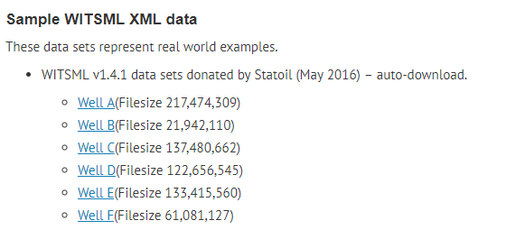

# WITSML 


## R and xml

* https://lecy.github.io/Open-Data-for-Nonprofit-Research/Quick_Guide_to_XML_in_R.html
* 

## References


* Data Modelling and WITSML: https://www.slideshare.net/inforacer/ecim-2012-chris-bradley-final

* What is WITSML: https://www.welldatalabs.com/2017/01/what-is-witsml/
* [What is WITSML?](http://uogc.com/what-is-witsml/) *United Oil & Gas Consulting*

* [WITSML Standards](http://www.energistics.org/drilling-completions-interventions/witsml-standards) *Energistics Energy Standards*

* [Data Exchange and Open Standards](http://www.witsml.net/about_us.htm) *WITSML.net*
* WITSML developer: https://www.energistics.org/witsml-developers-users/
* [Focused on WITSML Data for a Week and Here’s What Happened](https://medium.com/hashmapinc/i-focused-on-witsml-data-for-a-week-and-heres-what-happened-ce57e880b7ca)


## Development

* Standard SDK: https://www.energistics.org/standards-devkit/

* Library in Net: https://bitbucket.org/energistics/devkit-c/src
* Library in Java: https://github.com/hashmapinc/WitsmlObjectsLibrary
* WITSML client: https://github.com/hashmapinc/witsml-client
* Sample datasets: https://www.energistics.org/witsml-developers-users/#Example_WITSML_XML_data

>  Well A is 217 MB size.



* Convert xml2 to HDF5 using Python: https://gitlab.idiap.ch/bob/bob/blob/94d2e2a0b68e076bfb6b71596552e7cf873438ca/python/machine/lib/example/xml2hdf5.py
* 


---
title: "Exploring drilling data from the Volve dataset with WITSML and R"
author: "Alfonso R. Reyes"
date: '2019-01-27'
slug: exploring-drilling-data-with-witsml-and-r
tags: []
categories:
- drilling
- data structures
---

```{r setup, include = FALSE, error=TRUE, message=FALSE, warning=FALSE}
knitr::opts_chunk$set(echo = TRUE, 
                      comment = "#>",
                      collapse = TRUE,
                      error = TRUE,
                      warning = FALSE,
                      message = FALSE,
                      fig.align = 'center'
                      )
```

# Introduction
This time we will exploring drilling data that is stored using the industry standard [WITSML][witsml]. This format is widely used in the industry in drilling, completion and intervention operations, specifically for real-time surveillance. WITSML stands for *Wellsite Information Transfer Standard Markup Language*. It has a series of rules to save the data as a consistent schema but essentially is XML. Software developers and IT professionals in the oil industry know it very well. They mostly use in-house developed scripts, SDK[^SDK] in Java, [.Net][^dotnet], [C#][^csharp], or applications provided by vendors. This standard is essential to send and receive data between the rig and the offices or servers.

Since we are not writing for software developers or IT techs but for **petroleum engineers**, we need to know at least the basics of WITSML. Don't need to be experts on the subject but at least get familiar with the shape of the data, manipulation, perform some data exploration, and ultimately, be prepared, or know, what they are talking about when it is time to build an artificial intelligence agent based on a machine learning algorithm.

> On Artificial Intelligence. Again, let's touch Earth here. There is no robot, or Terminator, or an intelligent, cognitive entity. Artificial Intelligence or AI is about making agents or applications to perform a repetitive or boring tasks that otherwise would be peformed by a human being. It is simple math, statistics and computer science.

# Motivation
I have always been intrigued by `WITSML`. Not being a drilling engineer kepts me some distance away from the daily touch with this type of data. When I had the chance, I have explored the WITSML data with a XML viewer and one thing is clear: this is not your regular nice, rectangular data, or table, that we work every day. WITSML uses a [hierarchical][hierarchical_data] data structure, pretty similar to a tree: branches and leaves. This makes it very unusual to those who are familiar with just row and columns tables. What we will try to do in this lecture is getting a basic understanding of a different [data structure][data_structure]. As a matter of fact, I find *hierarchical data structures* very applicable to production and reservoir engineering because they give us a lot of freedom in creating multiple levels for our data.

# WITSML and the Volve Dataset
We were very fortunate of getting the [Volve dataset][volve_dataset] published 7 months ago. It covers a wide array of data from different disciplines (production, reservoir, geophysics, drilling, completion, logging, etc.), with data coming in different formats. It is a very good exercise of data science for exploring the data and making discoveries.

Here is a view of all the wells that are storing data in WITSML format:

```{r, out.width = "450px", echo=FALSE}
knitr::include_graphics("/img/witsml-all_wells.png")
```

Look at the size of each folder. They are considerable large if we compare to the usual files we manage every day. I am choosing the folder in row 22, one of the smaller data containers. If the data operations we perform here are all correct, then they should apply to any of the larger WITSML datasets.

```{r, out.width = "300px", echo=FALSE}
knitr::include_graphics("/img/witsml-typical_well.png")
```

A typical well with data stored in WITSML would look like this:

```{r, out.width = "300px", echo=FALSE}
knitr::include_graphics("/img/witsml-typical_well.png")
```

From all these folders, let's focus today in the **well trajectory** dataset. I downloaded all the drilling data for Volve which is about 26.8 GB. Not that big if we compare to the seismic files of 1.2 and 2.4 terabytes. I chose the `trajectory` folder for well `Norway-Statoil-NO 15_$47$_9-F-9` because it seems complex enough to studying it. Besides, it wasn't too big: around 27 MB. After learning from it, we could apply our data conversion algorithms to simpler datasets.

# The `trajectory` folder and files
The `trajectory` folder is very simple. It contains WITSML files and a metadata information file (not important at this time). The folder could contain more than one file. We will see in another lecture wells with more than one trajectory file. In our example, the WITSML file has the name of `1.xml`. We will be reading it in few seconds.

```{r, out.width = "500px", echo=FALSE}
knitr::include_graphics("/img/witsml-trajectory_folder.png")
```

# Data operations
Let's take a look first at the `trajectory` WITSML file. We are starting with a  collapsed tree so it doesn't take too much space of the screen. The `(+)` signs on the left means that it willl expand at that node. 

```{r, out.width = "500px", echo=FALSE}
knitr::include_graphics("/img/witsml-collapsed.png")
```

Some of these nodes will have children, others will just contain values as is the case of the nodes that go from `nameWell` up to `aziRef`.

```{r, out.width = "500px", echo=FALSE}
knitr::include_graphics("/img/witsml-orphans.png")
```

The node `trajectoryStation` has also child nodes as we show below for the first child member.

```{r, out.width = "600px", echo=FALSE}
knitr::include_graphics("/img/witsml-trajectoryStation.png")
```

Note that on the right of `trajectoryStation` there is a keyword named `uid`. This is called an __attribute__ of the node. In this particular case, that `uid` is the unique identifier of that measurement point. All of them are unique.

Another interesting finding is that not all `trajectoryStation` nodes have the same number of variables. Compare the figure above with this coming from a similarly named node:

```{r, out.width = "500px", echo=FALSE}
knitr::include_graphics("/img/witsml_tS_complete.png")
```

This hierarchical structure, as we can see, is very flexible. If there are not values, or measurements, they will not take space during storage. In tables or dataframes, they would usually be present but filled with **NA**s.

## Reading a WITSML file
We will use two packages: `xml2`, `data.table` and `dplyr`. `xml2` will take care of reading the WITSML files, while `dplyr` and `data.table` will be our workhorses for dataframe generation and data manipulation.


```{r}
library(xml2)
library(data.table)
library(dplyr)
```

```{r}
witsml_dir <- "./witsml"
all_files_xml <- list.files(witsml_dir, recursive = TRUE, full.names = TRUE, 
                        include.dirs = TRUE, pattern = "*.xml")

# indices in R start at 1, not zero as in Python
all_files_xml[73:83]    # just get few of the results
```

We get lots of XML files under the folder `witsml`. Let's focus our attention in the `trajectory` files.

```{r}
# get the file for trajectory
traj_files <- grep(pattern = "trajectory", ignore.case = TRUE, 
                   value = TRUE, x = all_files_xml)
traj_files
```

```{r}
# get the name of the root node
dat <- read_xml(traj_files[1])
xml_name(dat)
```

```{r}
# name of the child node
xml_name(xml_children(dat))
```


What we want now is get a rough idea of the structure of the hierarchies and the data. We use the function `xml_find_all` and `xml_path`. We list only few of the of the children nodes. Also, we get the total number of these end nodes.

```{r}
source("witsml-funcs.R")
results <- get_results_xml()
```


```{r eval=FALSE}
# strip default namespaces from the document
xml_ns_strip(cdat)
cdat %>% 
    xml_find_all( '//*') %>% 
    xml_path() %>% 
    .[1:50]                   # show only the first 50 elements
```

```{r, echo=FALSE}
# source("witsml-funcs.R")
# show_50()
results$show_all_elems[1:50]
```

```{r eval=FALSE}
# get the number of elements
dat <- xml_ns_strip(dat)
noe <- dat %>% 
    xml_find_all( '//*') %>% 
    xml_path() %>% 
    length()
noe
```
```{r echo=FALSE}
results$length_all_elems
```

Observe that from the child node `trajectory` branch lots of the variables. Let's see how many child nodes `trajectory` is holding:

```{r eval=FALSE}
# another way of obtaining the names of the nodes for "trajectory"
xml_name(xml_children(xml_find_all(dat, "//trajectory")))
```

```{r echo=FALSE}
results$children_trajectory
```

```{r eval=FALSE}
# number of trajectoryStation children nodes
length(xml_name(xml_children(xml_find_all(dat, "//trajectorys/trajectory" ))))
```

```{r echo=FALSE}
results$length_children_trajectory
```


If you click of the `(+)` sign on the nodes `nameWell` through `aziRef` you will find they don't have children; they only are holding values. Those are the end of the nodes. Do the same with any of the nodes `trajectoryStation`; they still have children. Continue pressing on the `(+)` sign until there are no more nodes expanding.

### //trajectory orphans
Since we found the end of the nodes for the first 14 vectors, let's extract the names of the variables:

```{r eval=FALSE}
# name of the orphan nodes
orphan_vars <- c(1:14)
vars14_names <- xml_name(xml_children(xml_find_first(dat,                                            "//trajectory")))[orphan_vars]
vars14_names
```

```{r echo=FALSE}
results$vars14_names
```

## //trajectory/trajectoryStation

```{r eval=FALSE}
# names of the nodes for "trajectoryStation"
xml_name(xml_children(xml_find_first( dat, "//trajectory/trajectoryStation")))
```


## Creating dataframes from hierarchical data

```{r}
# code
```


# Notes
* For the first row of `trajectoryStation`, which corresponds to the `TIE_POINT`, make all the empty variables (those not present) as NA. The `data.table` function works very well evening out those variables that are incomplete but filling them with default values. We see, for instance, that for first member of the  `trajectoryStation`, the variables are only 10, without counting `commonData`.

* In upcoming versions we should take care of coercing the variables to their corresponding types. By default, in this example, we've got all the variables as character. Because we know in advance the data types because of the WITSML standard, we could use the **R** package `readr` to do the coercion.

* As we get familiar with the WITSML hierarchies, we could start using loops or `apply` functions to convert a tree structure to dataframes.

* Functions can be implemented later to get the number of trajectory stations, find which `trajectoryStation` does not have its complete set of variables, or extract a particular trajectory measurement.

* In this example, we used only one well. That's why we obtained only one trajectory file. Other wells could have more than one trajectory file. Later we could implement a function that scans all the folders and generates a summary statistic of the number of folders, number of files per well, size, etc.

# References

WITSML 1.3.1.1: http://w3.energistics.org/schema/witsml_v1.3.1.1_data/doc/WITSML_Schema_docu.htm

WITSML 1.4.0 schema: http://w3.energistics.org/schema/witsml_v1.4.0_data/doc/witsml_schema_overview.html

[^SDK]: Software Development Kit
[^dotnet]: A Microsoft development platform
[^csharp]: A Microsoft flavor of C++


[volve_dataset]: https://www.equinor.com/en/news/14jun2018-disclosing-volve-data.html

[witsml]: https://www.energistics.org/portfolio/witsml-data-standards/

[data_structure]: https://en.wikipedia.org/wiki/Data_structure

[hierarchical_data]: https://medium.freecodecamp.org/all-you-need-to-know-about-tree-data-structures-bceacb85490c